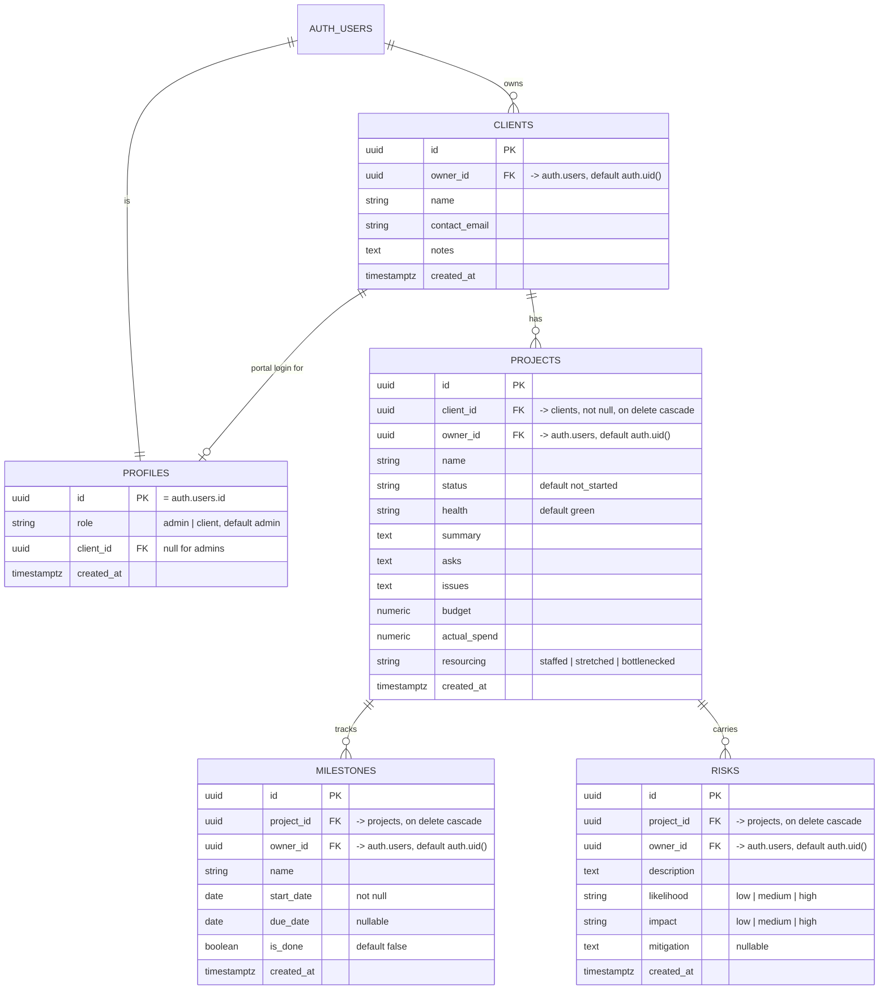

# Client Portal — Data Model

*Last updated: 2026-07-04 · Status: reflects live schema through Day 19.*

The blueprint of what the app actually stores and how it connects.
*(GitHub renders the diagram below automatically.)*

---

## ERD

> `||` = one, `o{` = many, `o|` = zero-or-one. **PK** = unique row ID.
> **FK** = a pointer to another table's row (the wire that makes the connection).
> `auth.users` is Supabase's built-in auth table — we don't create it.

---

## Conventions shared by every table

- **RLS is ON** for all five tables — every read/write is filtered by a policy in
  the database, not just by the app.
- `id uuid PK default gen_random_uuid()` — **except `profiles`**, whose `id` *is*
  the `auth.users.id` (one profile per login).
- `created_at timestamptz default now()`.
- `owner_id uuid references auth.users(id) default auth.uid()` on clients,
  projects, milestones, risks — auto-stamped to whoever is logged in. This is the
  column the per-user RLS policies key off.

---

## The tables (plain words)

### profiles
The app-level row for each login (`id` = `auth.users.id`, `on delete cascade`).
- `role text default 'admin'`, `CHECK (role in ('admin', 'client'))` — separates
  the consultant (admin) from a client's read-only portal login.
- `client_id references clients(id)` — set for client logins (which client they
  can see); null for admins.
- **RLS:** read-own-profile SELECT only (`auth.uid() = id`). **No insert/update
  policies** — so a user cannot change their own `role`.
- A `handle_new_user` trigger (SECURITY DEFINER) auto-inserts a default-admin
  profile row on each new signup.

### clients
The consulting clients. `owner_id` points to the consultant who owns the row.
- **RLS:** 4 per-user policies (select / insert / update / delete), each
  `auth.uid() = owner_id`, **plus** an additive client-viewer SELECT so a portal
  user can read their own client:
  `id = (select client_id from profiles where id = auth.uid())`.

### projects
Live under a client (`client_id not null references clients(id) on delete
cascade`). Holds name, status, RAG health, the executive-summary text, and
financials.
- `status` — `CHECK in ('not_started','active','on_hold','completed','cancelled')`,
  default `not_started`.
- `health` — `CHECK in ('green','amber','red')`, default `green`.
- `resourcing` — `CHECK in ('staffed','stretched','bottlenecked')` (nullable).
- `summary`, `asks`, `issues` — nullable free text (Block 2, Executive Summary).
- `budget`, `actual_spend` — `numeric` (Block 4, Financials & Resources).
- **RLS:** 4 per-user policies (`auth.uid() = owner_id`), **plus** an additive
  client-viewer SELECT:
  `client_id = (select client_id from profiles where id = auth.uid())`.

### milestones
Live under a project (`project_id references projects(id) on delete cascade`).
Power the Timeline & Velocity Gantt chart (Block 3).
- `start_date` is **NOT NULL**; `due_date` is nullable.
- `is_done boolean` — the done/upcoming toggle (replaces an old status string).
- **RLS:** 4 owner CRUD policies (`auth.uid() = owner_id`), **plus** a nested
  viewer-read policy so a portal user sees milestones of their own projects:
  `project_id in (select id from projects where client_id =
  (select client_id from profiles where id = auth.uid()))`.

### risks
Live under a project (`project_id references projects(id) on delete cascade`).
Power Risks & Dependencies (Block 5).
- `likelihood` and `impact` each `CHECK in ('low','medium','high')`.
- `mitigation` nullable.
- **RAG severity is derived in code** (`app/risk-rag.ts`, a 3×3
  likelihood×impact matrix), **not stored** in the table.
- **RLS:** 4 owner CRUD policies, **plus** the same nested viewer-read shape as
  milestones (via the risk's `project_id → projects.client_id`).

---

## Relationships, one line each
- One **auth user** has exactly one **profile** (`profiles.id = auth.users.id`).
- One **auth user** owns many **clients** (`clients.owner_id`).
- One **client** is the portal target for zero-or-one **profile**
  (`profiles.client_id`) — how a client login is scoped to one client.
- One **client** has many **projects** (`projects.client_id`).
- One **project** has many **milestones** and many **risks**.
- Deleting a client cascades to its projects; deleting a project cascades to its
  milestones and risks.

---

## Access model in one breath
Admins (consultant) own their rows via `owner_id` and get full CRUD. A client
login carries a `client_id` on its profile and gets **read-only** access, granted
by the additive viewer SELECT policies that walk
`profile.client_id → clients → projects → (milestones, risks)`.

## Routing model
- `/` redirects to `/dashboard` — there is no longer a standalone clients list page.
- `/dashboard` is the **admin home** and hosts client CRUD (add / edit / delete),
  rendered client-first as one box per client. Login and signup land here.
- `/portal` is the client login's read-only home.
- ⚠️ **Destructive behavior:** deleting a client from the dashboard cascades in the
  DB (`ON DELETE CASCADE`) to that client's **projects**, and each project to its
  **milestones** and **risks** — all removed in one action. The UI guards this with
  a native `confirm()` that names the number of projects that will be destroyed.

---

## Deferred (not yet built)
Intentional post-MVP scope per the brief's MoSCoW — these are planned *Could*
features, not gaps in the current model:
- **Time-logging / `time_entries`** — daily effort per project + person, to drive
  hours totals and the FTE / resources-per-month rollup.
- **Invoicing & payments** — amounts, due dates, terms, paid/overdue status;
  drives payment tracking and late alerts.
- **Documents** — contracts, agreements, deliverables, invoices linked to a
  client/project.

Each gets its own table when we reach that feature.

---

> ⚠️ **Migrations gap:** this schema + all RLS policies live only in Supabase, not
> in git. Harden task.
