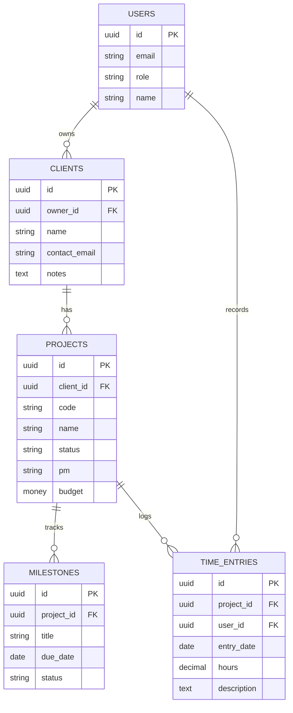

# Client Portal — Data Model

*Phase 10, Stage 3 (Architect) · Day 9 · 2026-06-24*

The blueprint of what the app stores and how it connects — the handoff into setting
up the database. *(GitHub renders the diagram below automatically.)*

---

## ERD

---

## The tables (plain words)

- **users** — login accounts. `role` distinguishes the consultant (you) from
  clients (who log in later for the read-only view).
- **clients** — the consulting clients. `owner_id` points to the consultant who
  owns the relationship.
- **projects** — live under a client (`client_id`). Holds the project code, name,
  RAG status, PM, budget. *(The full scorecard adds more fields — sponsor, summary,
  actual spend, etc. — added in slices during Build.)*
- **milestones** — live under a project (`project_id`). A title, a date, and a
  status (done / upcoming) — this powers the scorecard's accomplishments +
  deliverables and the 30-day window.
- **time_entries** — daily effort. Each entry points at *both* a project and the
  user who logged it — which is what lets us total hours per project *and* per
  person (the FTE / resources-per-month rollup).

## Relationships, one line each
- One **user** owns many **clients**.
- One **client** has many **projects**.
- One **project** has many **milestones** and many **time entries**.
- One **user** records many **time entries**.

> `||` = one, `o{` = many. **PK** = unique row ID. **FK** = a pointer to another
> table's row (the wire that makes the connection).

---

## Deferred tables (the *Could* features)
- **invoices / payments** — linked to a client (and/or project): amount, due date,
  terms, paid/overdue status. Drives payment tracking + late alerts.
- **documents** — linked to a client/project: contracts, agreements, deliverables,
  invoices.

Left out for now to keep the foundation clean; added as their own tables when we
reach those features.

---

## Note
This is the near-term core (the MVP plus the soon-after *Should* features). It will
live in a **new Supabase project** (kept separate from the learning DBs), with
per-row ownership rules (RLS) so a client can only ever see their own data — set up
in Stage 3.
